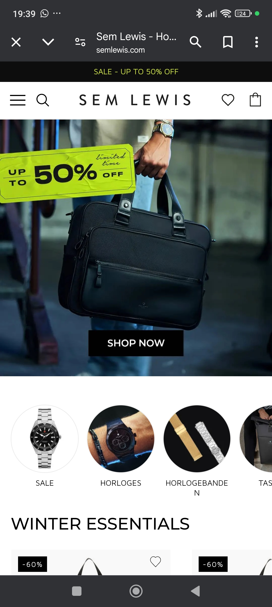
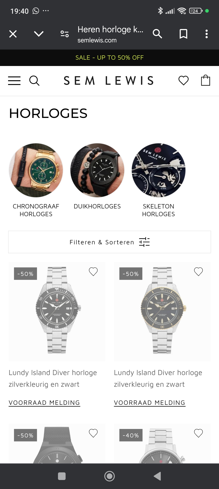
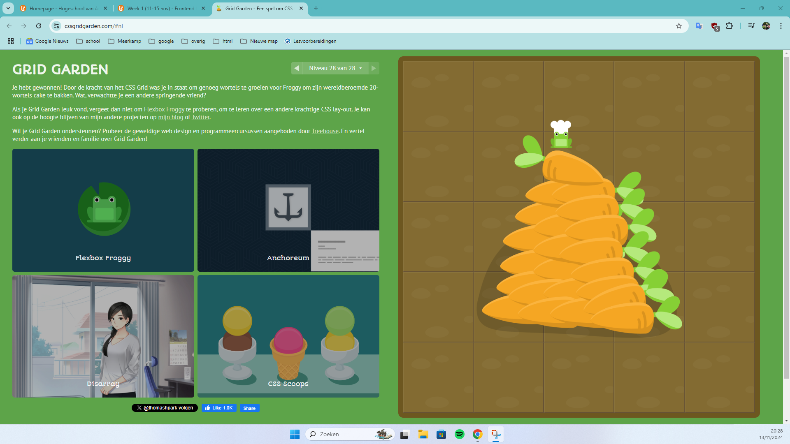
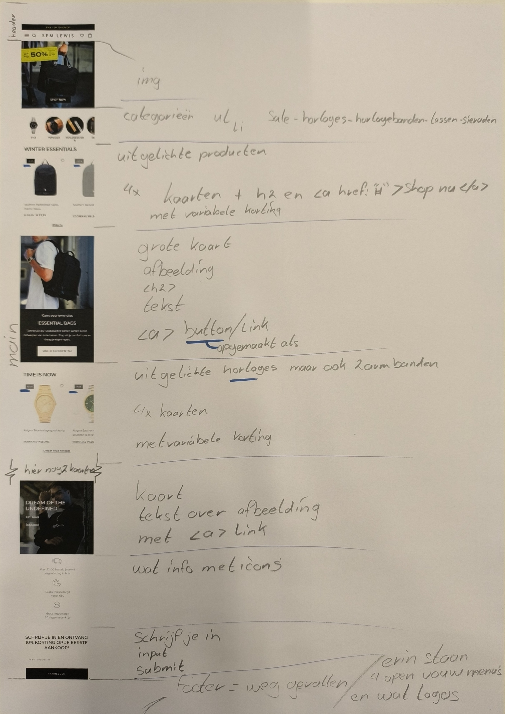
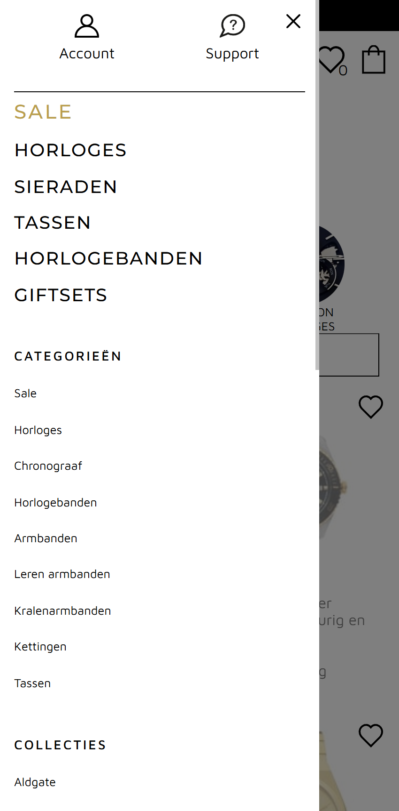
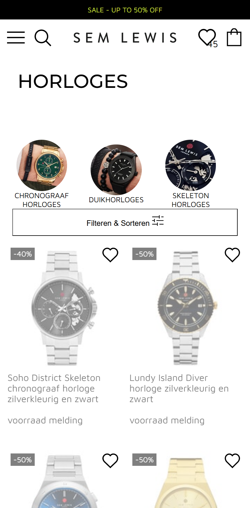

# Procesverslag

Markdown is een simpele manier om HTML te schrijven.  
Markdown cheat cheet: [Hulp bij het schrijven van Markdown](https://github.com/adam-p/markdown-here/wiki/Markdown-Cheatsheet).

Nb. De standaardstructuur en de spartaanse opmaak van de README.md zijn helemaal prima. Het gaat om de inhoud van je procesverslag. Besteedt de tijd voor pracht en praal aan je website.

Nb. Door *open* toe te voegen aan een *details* element kun je deze standaard open zetten. Fijn om dat steeds voor de relevante stuk(ken) te doen.

## Jij

  ### Auteur:
  Jamie Buffing

  #### Je startniveau:
  Rood

  #### Je focus:
  Surface plane
 

## Je website
  Sem Lewis
  
  https://www.semlewis.com/nl/

  
uitwerken voor kick-off werkgroep

  ### Je opdracht:
  https://www.semlewis.com/nl/

  #### Screenshot(s) van de eerste pagina (small screen): 
  Home pagina  
  

  #### Screenshot(s) van de tweede pagina (small screen):
  Horloges pagina  
  
 

## Toegankelijkheidstest 1/2 (week 1)

  
uitwerken na test in 2e werkgroep

  ### Bevindingen
  Afbeeldingen alt tekst:
  - De afbeeldingen hebben geen duidelijke alt tekst
  - De afbeeldingen schalen soms raar

  Tekst en kopjes in een screenreader:
  - De kopjes beschijven niet altijd goed wat er komen gaat
  - De tekst is soms niet genoeg om te weten watvoor product er te zien is
  - Je kan met tab door de menu's heen maar dan scrolt de pagina niet goed mee
  - het hamburgermenu opent niet om er doorheen te tabben

  WCAG checklist:
  - Content
    - Use plain language and avoid figures of speech, idioms and complicated metaphors.
      - ✅  
    - Make sure that button, a and label element content is unique and descriptive
      - ~
    - Use left-aligned text for right-to-left (TRL) languages
      - ✅ 
    
  - Global code
    - Validate your HTML
      - ❌
    - Use a lang attribute on the html element
      - ✅ 
    - Provide a unique title for each page or view
      - ✅ 
    - Ensure that viewport zoom is not disabled
      - ✅ 
    - Use landmark elements to indicate important content regions
      - ✅ 
    - Ensure a linear content flow
      - ✅ 
    - Avoid using the autofocus attribute
      - ~
    - Allow extending session timeouts
      - ✅ 
    - Remove title attribute tooltips
      - ✅ 
    
  - Keyboard
    - Make sure there is a visible focus style for interactive elements that are navigated to via keyboard input
      - Default
    - Check to see that keyboard focus order matches the visual layout
      - ❌
    - Remove invisible focusable elements
      - ❌

  - Images
    - Make sure that all img elements have an alt attribute
      - ❌
    - Make sure that decorative images use null alt (empty) attribute values
      - ❌
    - Provide a text alternative for complex images such as charts, graphs, and maps
      - ❌
    - For images containing text, make sure the alt description includes the image's text
      - ❌
    - Use heading elements to introduce content
      - ✅ 
    - Use only one h1 element per page or view
      - ✅ 
    - Heading elements should be written in a logical sequence
      - ~
    - Don't skip heading levels
      - ✅ 

  - Lists
    - Use list elements (ol, ul, and dl elements) for list content
      - ✅ 
  
  - Controls
    - Use the a element for links
      - ✅ 
    - Ensure that links are recognizable as links
      - ~
    - Ensure that controls have :focus states
      - Default
    - Use the button element for buttons
      - ❌
    - Provide a skip link and make sure that it is visible when focused
      - ✅ 
    - Identify links that open in a new tab or window
      - ✅ 

  - Tables
    - Use the table element to describe tabular data
      - NVT
    - Use the th element for table headers (with appropriate scope attributes)
      - NVT
    - Use the caption element to provide a title for the table
      - NVT

  - Forms
    - All inputs in a form are associated with a corresponding label element
      - ❌
    - Use fieldset and legend elements where appropriate
      - ✅ 
    - Inputs use autocomplete where appropriate
      - ❌
    - Make sure that form input errors are displayed in list above the form after submission
      - ✅ 
    - Associate input error messaging with the input it corresponds to
      - ~
    - Make sure that error, warning, and success states are not visually communicated by just color
      - ✅ 

  - Media
    - Make sure that media does not autoplay
      - NVT
    - Ensure that media controls use appropriate markup
      - NVT
    - Check to see that all media can be paused
      - NVT

  - Videos
    - Confirm the presence of captions
      - NVT
    - Remove seizure triggers
      - NVT

  - Audio
    - Confirm that transcripts are available
      - NVT
  
  - Appearance
    - Check your content in specialized browsing modes
      - ❌
    - Increase text size to 200%
      - ❌
    - Double-check that good proximity between content is maintained
      - ❌
    - Make sure color isn't the only way information is conveyed
      - ❌
    - Make sure instructions are not visual or audio-only
      - ~
    - Use a simple, straightforward, and consistent layout
      - ✅
  
  - Animation
    - Ensure animations are subtle and do not flash too much
      - ✅
    - Provide a mechanism to pause background video
      - NVT
    - Make sure all animation obeys the prefers-reduced-motion media query
      - ~

  
  - Color Contrast
    - Check the contrast for all normal-sized text
      - ✅
    - Check the contrast for all large-sized text
      - ✅
    - Check the contrast for all icons
      - ✅
    - Check the contrast of borders for input elements (text input, radio buttons, checkboxes, etc.)
      - ~
    - Check text that overlaps images or video
      - ~
    - Check custom ::selection colors
      - ~

  
  - Mobile and touch
    - Check that the site can be rotated to any orientation
      - ✅
    - Remove horizontal scrolling
      - ✅
    - Ensure that button and link icons can be activated with ease
      - ✅
    - Ensure sufficient space between interactive items in order to provide a scroll area
      - ✅

### Grid garden oefening
  

## Breakdownschets (week 1)

  
uitwerken na afloop 3e werkgroep

  ### de hele pagina: 
  

  ### dynamisch deel (bijv menu): 
  

## Voortgang 1 (week 2)

  
uitwerken voor 1e voortgang

  ### Stand van zaken
  In week 1 heb ben ik van boven naar beneden begonnen met het maken van de website, Als eerst heb ik de header gemaakt met navigatie. Daarna ben ik begonnen met het maken van de eerste banner en de categorieën.

## Voortgang 2 (week 3)

  
uitwerken voor 2e voortgang

  ### Stand van zaken
  Bij dit voortgangsgesprek had ik alleen nog pagina 1 deels af en moest ik nog veel doen

  ### Verslag van meeting
  In de meeting heb ik vragen gesteld over de code die ik had en is mij verteld dat ik moet gaan beginnen met de Readme

## Toegankelijkheidstest 2/2 (week 4)

  
uitwerken na test in 9e werkgroep

  ### Bevindingen
  De site is volledig toegankelijk met een screenreader. Op een paar plekken wordt informatie dubbel gegeven maar overal is de juiste informatie te horen.

  WCAG checklist:
  - Content
    - Use plain language and avoid figures of speech, idioms and complicated metaphors.
      - ✅  
    - Make sure that button, a and label element content is unique and descriptive
      - ~
    - Use left-aligned text for right-to-left (TRL) languages
      - ✅ 
    
  - Global code
    - Validate your HTML
      - ✅
    - Use a lang attribute on the html element
      - ✅ 
    - Provide a unique title for each page or view
      - ✅ 
    - Ensure that viewport zoom is not disabled
      - ✅ 
    - Use landmark elements to indicate important content regions
      - ✅ 
    - Ensure a linear content flow
      - ✅ 
    - Avoid using the autofocus attribute
      - ✅
    - Allow extending session timeouts
      - ✅ 
    - Remove title attribute tooltips
      - ✅ 
    
  - Keyboard
    - Make sure there is a visible focus style for interactive elements that are navigated to via keyboard input
      - Default
    - Check to see that keyboard focus order matches the visual layout
      - ~
    - Remove invisible focusable elements
      - ~

  - Images
    - Make sure that all img elements have an alt attribute
      - ✅
    - Make sure that decorative images use null alt (empty) attribute values
      - ❌
    - Provide a text alternative for complex images such as charts, graphs, and maps
      - ✅
    - For images containing text, make sure the alt description includes the image's text
      - ✅
    - Use heading elements to introduce content
      - ✅ 
    - Use only one h1 element per page or view
      - ✅ 
    - Heading elements should be written in a logical sequence
      - ✅
    - Don't skip heading levels
      - ✅ 

  - Lists
    - Use list elements (ol, ul, and dl elements) for list content
      - ✅ 
  
  - Controls
    - Use the a element for links
      - ✅ 
    - Ensure that links are recognizable as links
      - ✅
    - Ensure that controls have :focus states
      - Default/✅
    - Use the button element for buttons
      - ✅
    - Provide a skip link and make sure that it is visible when focused
      - ✅ 
    - Identify links that open in a new tab or window
      - ✅ 

  - Tables
    - Use the table element to describe tabular data
      - NVT
    - Use the th element for table headers (with appropriate scope attributes)
      - NVT
    - Use the caption element to provide a title for the table
      - NVT

  - Forms
    - All inputs in a form are associated with a corresponding label element
      - ✅
    - Use fieldset and legend elements where appropriate
      - ✅ 
    - Inputs use autocomplete where appropriate
      - ✅
    - Make sure that form input errors are displayed in list above the form after submission
      - ✅ 
    - Associate input error messaging with the input it corresponds to
      - ~
    - Make sure that error, warning, and success states are not visually communicated by just color
      - ✅ 

  - Media
    - Make sure that media does not autoplay
      - ✅
    - Ensure that media controls use appropriate markup
      - ✅
    - Check to see that all media can be paused
      - ✅

  - Videos
    - Confirm the presence of captions
      - NVT
    - Remove seizure triggers
      - NVT

  - Audio
    - Confirm that transcripts are available
      - NVT
  
  - Appearance
    - Check your content in specialized browsing modes
      - ❌
    - Increase text size to 200%
      - ~
    - Double-check that good proximity between content is maintained
      - ❌
    - Make sure color isn't the only way information is conveyed
      - ✅
    - Make sure instructions are not visual or audio-only
      - ~
    - Use a simple, straightforward, and consistent layout
      - ✅
  
  - Animation
    - Ensure animations are subtle and do not flash too much
      - ✅
    - Provide a mechanism to pause background video
      - NVT
    - Make sure all animation obeys the prefers-reduced-motion media query
      - ✅

  
  - Color Contrast
    - Check the contrast for all normal-sized text
      - ✅
    - Check the contrast for all large-sized text
      - ✅
    - Check the contrast for all icons
      - ✅
    - Check the contrast of borders for input elements (text input, radio buttons, checkboxes, etc.)
      - ✅
    - Check text that overlaps images or video
      - ✅
    - Check custom ::selection colors
      - ✅

  
  - Mobile and touch
    - Check that the site can be rotated to any orientation
      - ✅
    - Remove horizontal scrolling
      - ✅
    - Ensure that button and link icons can be activated with ease
      - ✅
    - Ensure sufficient space between interactive items in order to provide a scroll area
      - ✅

## Voortgang 3 (week 4)

  
uitwerken voor 3e voortgang

  ### Stand van zaken
  Hier had ik pagina 1 bijna helemaal af en moest ik alleen nog mijn footer afmaken en mijn hamburgermenu

  ### Agenda voor meeting
  Jamie

  1. Welke form van de footer ik moest aanhouden, die van de breakdown of de huidige
  2. 
  3. 

  ### Verslag van meeting
  hier na afloop snel de uitkomsten van de meeting vastleggen

  - Maakte niet uit dus ik ben die van de breakdown gaan maken
  - -
  - -

## Eindgesprek (week 5)

  
uitwerken voor eindgesprek

  ### Je uitkomst - karakteristiek screenshots:
  

  ### Dit ging goed/Heb ik geleerd: 
  Hoe ik het beste een site kan namaken en waar ik dan aan moet denken, ik ben er achter gekomen dat het best veel werk is en je van tevoren goed moet kijken naar de hierarchie van de site. Hierbij kan je ook al meteen opletten waar ze welke kopjes gebruiken en wat in het origineel dus verschillende delen zijn.

  

  ### Dit was lastig/Is niet gelukt:
  Het is door de tijd niet gelukt om ook te zorgen dat er nog een paar kleine dingen op de pagina werken zoals de hartjes die veranderen van kleur of die er ook weer af kunnen gaan.

  

## Bronnenlijst

  
continu bijhouden terwijl je werkt

  Nb. Wees specifiek ('css-tricks' als bron is bijv. niet specifiek genoeg). 
  Nb. ChatGpT en andere AI horen er ook bij.
  Nb. Vermeld de bronnen ook in je code.

  1. [a11lyproject](https://www.a11yproject.com/posts/how-to-hide-content/)
    - visualy hidden

  Er staat erg weinig dat klopt, de meeste trucs heb ik mezelf al aangeleerd het afgelopen jaar door ook als hobby wat websites en dingen te maken.

